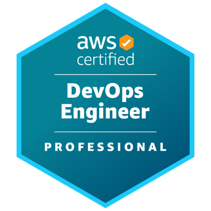
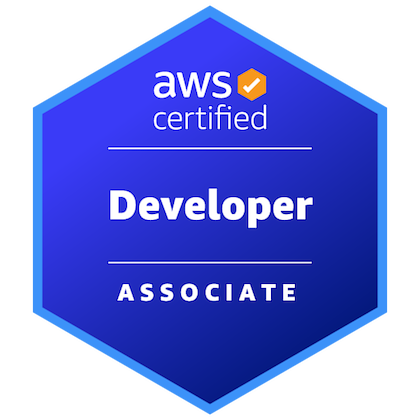
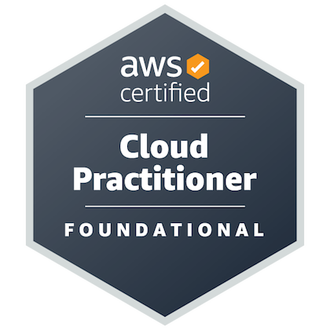

# Nikhil Kulkarni

AI engineering and MLOps. I build inference infrastructure and agent-native tools.

SF Bay Area, CA · [nikhilkulkarni1755.com](https://nikhilkulkarni1755.com) · [Resume](https://drive.google.com/file/d/1lEbvJPA_pyGYIsArTv9l0f1p0aD72H49/view?usp=sharing)

---

## Building

| Project | What it is |
| --- | --- |
| **[Iridium](https://iridiumhqmcp.com)** | Connect Claude or ChatGPT to your LinkedIn. Your agent reads profiles and posts, then drafts the comments, replies, and connection requests - and nothing sends until you approve it. This MCP Server was demo'd at WorkOS Demo Night. Perfect for people hiring and people jobseeking |
| **[vLLM on EKS](https://github.com/nikhilkulkarni1755/vllm-eks-deployment)** | Multi-tenant GPU inference on a hard two-A10G budget. 2 Versions - Multimodel (each GPU hosts one model) vs Monomodel (scaling). Rebuilt on real scale-out, held under two-hour soaks. |

## Open source

| Repo | Contribution |
| --- | --- |
| [vllm-project/vllm](https://github.com/vllm-project/vllm/pulls?q=is%3Apr+author%3Anikhilkulkarni1755) | Plamo2 crashed loading on transformers v5 because `_tied_weights_keys` had quietly changed from a list to a dict — the kind of upstream break that only surfaces in someone else's model runner. **1 merged**. |
| [sgl-project/sglang](https://github.com/sgl-project/sglang/pull/32977) | Batching embedding requests silently dropped their priority, so scheduling order stopped meaning anything once the batcher ran. Carried priority through the batch. **1 merged**. |
| [ax-platform/ax-agent-studio](https://github.com/ax-platform/ax-agent-studio/pulls?q=is%3Apr+author%3Anikhilkulkarni1755) | Built integrated auth and the agent monitoring dashboard, then fixed a long-polling message-format mismatch that stalled the loop. **2 merged**. |

## Smaller Interesting Tools

- **[Terminal Tweet](https://github.com/nikhilkulkarni1755/twitter-oauth2)** — post to X from your terminal. OAuth 2.0 PKCE, media uploads over OAuth 1.0a, and a server mode so agents can call it.
- **[agent-tutorial](https://github.com/nikhilkulkarni1755/agent-tutorial)** — a coding agent in Node.js, following Adam Wathan's tweet and the ampcode post, with logging added so you can watch it think.
- **[finetuned-t5](https://github.com/nikhilkulkarni1755/finetuned-t5-tokenizer)** — T5-small finetuned on 280+ examples across 12 STEM fields to turn scrappy project notes into resume bullets. Trains in 15 minutes on a 4060.

## Certifications

| AWS DevOps Engineer – Professional | AWS Developer Associate | AWS Cloud Practitioner |
| :---: | :---: | :---: |
|  |  |  |

## Before this

Two years of frontend at Google, via Tata Consultancy Services. Rutgers CS, 2021. Shipped [The Progress App](https://apps.apple.com/us/app/the-progress-app/id6503723392) to the iOS App Store.

---

[LinkedIn](https://linkedin.com/in/nikhilkulkarni1755) · [X](https://x.com/nsk1755) · [Medium](https://medium.com/@nikhilkulkarni1755/list/software-development-521666c6ad58) · [nikhilkulkarni1755@gmail.com](mailto:nikhilkulkarni1755@gmail.com)
